#SISTEMAS DE GESTIÓN EMPRESARIAL 
#CLASSNOTES
***
#22-9-23

###CRM Y ERP

Definiciones. Usos de cada uno. Un CRM puede ser parte de un ERP en empresas grandes sobre todo.

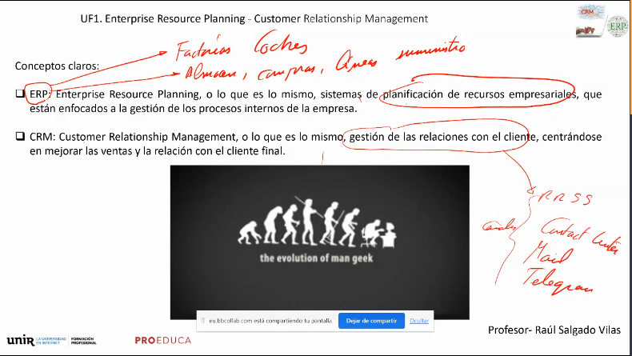

###ERP 
Toda la información pasa a formar parte de la cadena de valor de la compañía, se destruyen los chiringuitos. PROCESO END-TO-END, de extremo a extremo. 

Raul es responsable de integración END TO END, integra toda la cadena hasta el final con todas las tecnologías y con todos los departamentos. Se acaba con los reinos de taifas en las empresas, por lo que al implantar ERP te encuentras con bastantes enemigos y gente en contra en la empresa. Habla de que hacen falta personas con un perfil de soft skills amplio y acentuado, habla de la certificación internaciioanl de gestion de proyectos PMP para ser director de proyectos. Esto no va solamente de saber programar. El ERP democratiza la gestión, acaba con directores chiringuiteros, opacidad en presupuestps. CEO de una empresa no tiene dudas en implantar ERP y gastarse una pasta porque el retorno de la inversión es rapido, se amortiza rápido, es una jugada segura.

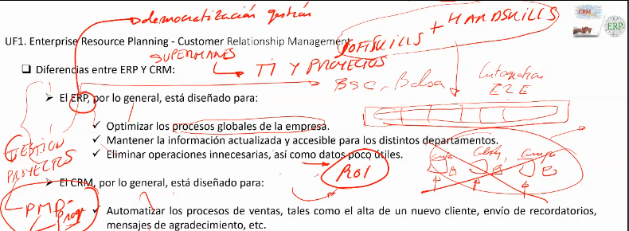

###CRM
Procesos de venta sobre todo, todo lo relacionado con el cliente. 

Podemos integrar muchas cosas: IoT (en zara cada vez que entras hay sensores que saben donde te paras a mirar por ejemplo), Inteligencia Artificial. Con eso recoger información, que son líneas calientes. Con esa información creamos BBDD con fines de marketing y prevision de ventas, tendencias, etc.

Salud de ventas: si el CRM va mal tus ventas van mal: Serio problema.

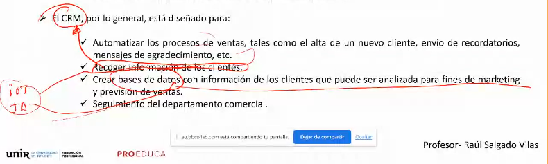

###NOTAS
Los dispositivos con el ASR con el procesamiento del lenguaje todo lo que hablas te sale despues en los anuncios en las busquedas. Es una realidad.
Mundo cambiantes. Mueren grandes empresas nacen nuevas. OPENAI de chatgpt no la conocia nadie, ahora en number1 mundial. Google va camino de morir, está tocada de muerte (muerte de los buscadores con la IA, copilot. ÉL no usa buscador, usa copilot ya. En los buscadores hasta que encuentras algo que merece la pena tienes que buscar millones de cosas)

### A CABALLO ENTRE EL ERP Y EL CRM

Automatización e integración, EndToEnd, van de la mano.

Entre los dos mundos tengo todas las tareas que un mundo puede derivar a otro y pasa por un area en común de automatización. EJ: si fabrico coches el tener información de las ventas de mis cadenas de CRM me dice la prevision la producción que tengo. 

Hay carreteras de ida y vuelta en ambas direcciones. ERP monetizacion CRM interacciones de cliente.

Un ERP es tan importante que hay empresas que quieren que el CRM sea parte del ERP, qu esté integrado. Hay clientes que lo piden. Hay que hacer integraciones, hay que buscarse la vida. Vale mas gente que sepa integrar apis que alguien que sepa mucho de desarrollo de java o android y tal. Integración es muy importante hoy en dia, se cobra mas por integrar.

Los erps y crms son el segmento de la TI que mas pasta mueve. Los salarios son el doble o mas que los de desarrollo.

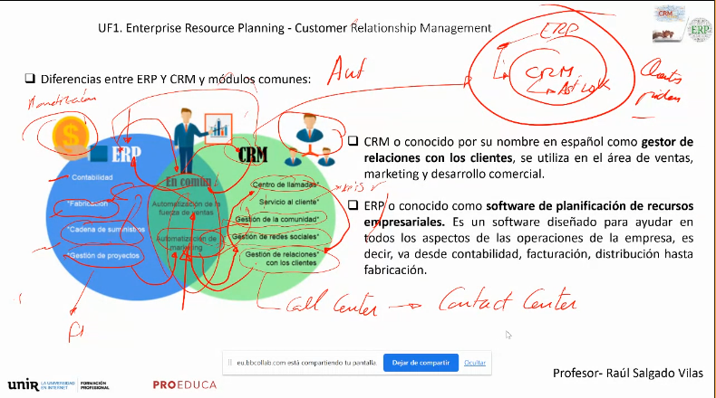

### VENTAJAS ERPS

Hay erps que dan salto cualitativo. Meten Business Intelligence. Siempre un proyecto de ERP desencadena un proyecto de BI.

Es sí mismo el BI es un proyecto gordo, del que surge el BIG DATA (la rama es el BI: el big data es un BI, es la plasmación del sistema que da soporte a toda la inteligencia de negocio), que va de la mano del IA. "Un master de BIG DATA debería ser un master en BI", es una cuestión de marketing y de que no tienen ni puta idea.

Estos sistemas son muy complejos y son la pomada del techie. Los matemáticos están ahí ahora, ya no dan clase.

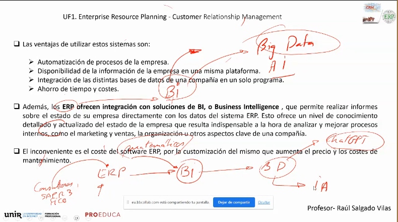

### RECAPITULAMOS

Un Sistema de Gestión empresarial controla organiza y dirige los procesos de una empresa, además de los contactos con el cliente.

ERP controlaorganiza y dirige los procesos de una empresa. CRM contactos con el cliente.

Muchos ERPs tienen funcionalidades de CRM. Los CRM no tienen ERP.

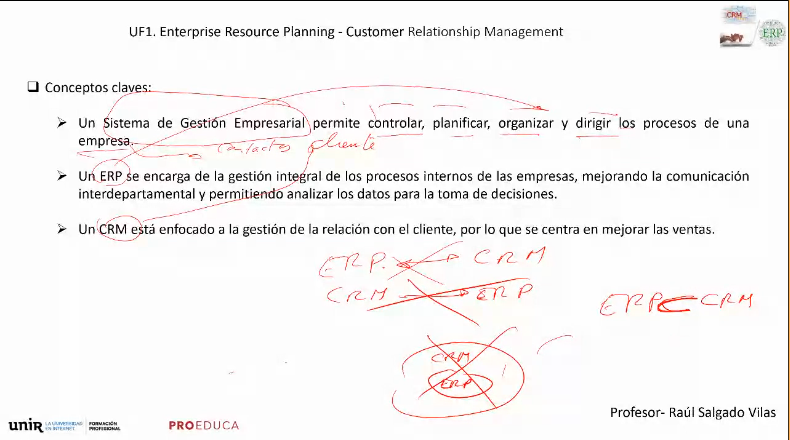

### PROYECTOS ERP vs CRM

Un cliente muchas veces no sabe lo que necesita. Te plantea necesidades. Tu recoges requisitos y no sabes lo que necesita. Dicotomía entre ERP o CRM o ambos. Elección de paquetes. Hay que ajustar necesidades al presupuesto para no perder la confianza del cliente. Esto es básico, una buena prospeccion de necesidades y requisitos del cliente.

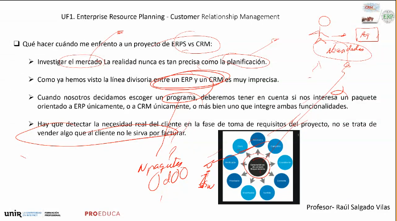

### DILEMAS PROYECTO

####1Software de mercado VS software customizado. 

El customizado puede ser de integración o de desarrollo. Ejemplo traje a medida,un clásico. EL sastre te lo va a ajustar a tus necesidades.

Un software de mercado es mas barato, ahora, no se pueden hacer virguerías. Un salesforce de tipo SAAS en la nube por ejemplo. Es una solucion modular que baja la factura pero la funcionalidad es la que es.

####2OnPremise VS Cloud

On premise es en los CPDs del cliente (Centros de procesamiento de Datos, infraestructura e instalaciones propias). 

La otra opción es en Cloud. IaaS.

Aquí surge el tema de La seguridad, que es importante. El 90% de los contratos de seguridad lo que hacen es defender SGEs. Todos los SOC (security operation center) se dedican a defender los SGEs. Es donde está la pasta de la compañía. Las BBDD. En cualquier caso, tanto en OnPremise como en IaaS hay que ver bien el tema de la seguridad.

La LPD, la ley de portección de datos es importante para todos estos temas.

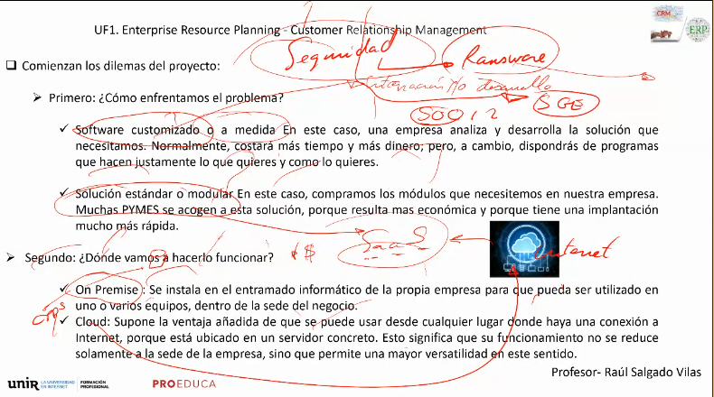

####3.Soft Skills Jefe de Proyecto

Hemos hablado de ellas. Hay que tener toda la información del cliente y sacarla con mucho tacto.

Estructura compleja del personal de los proyectos, desde el jefe hasta los directores y los técnicos.

Búsqueda de soluciones a respuestas negativas. Nunca decimos no se puede hacer al cliente. ("Mas pasta").

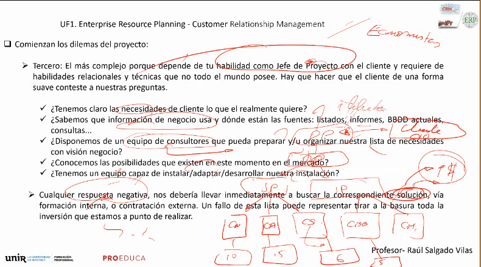

### ELECCIÓN SISTEMA ADECUADO

Preguntas lógicas que hay que hacer al cliente.

Conocer a la gente de los departamentos. Habrá gente que te lo va a poner fácil y gente que te va a putear hasta el extremo. Hay que localizar y neutralizarlos cuanto antes. Hay muchas estrategias.

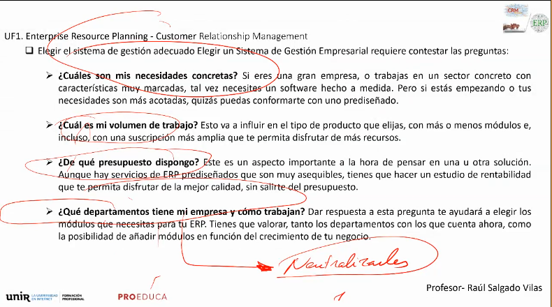

### CHECKLIST MUSTS

Nos adaptamos nosotros a la empresa. No vale el "no sé" ni el "no se puede". La empresa no se adapta al ERP, el ERP se adapta a la empresa. El cliente es el rey. Se dan soluciones generales o particulares para resolver el problema que tiene el cliente.

Debe ser completo. Hay que pensar en todo.

Un AS IS es un "Como estan tus sistemas", un chequeo.

Escalabilidad horizontal es clave. Amigable.

SEGURO.

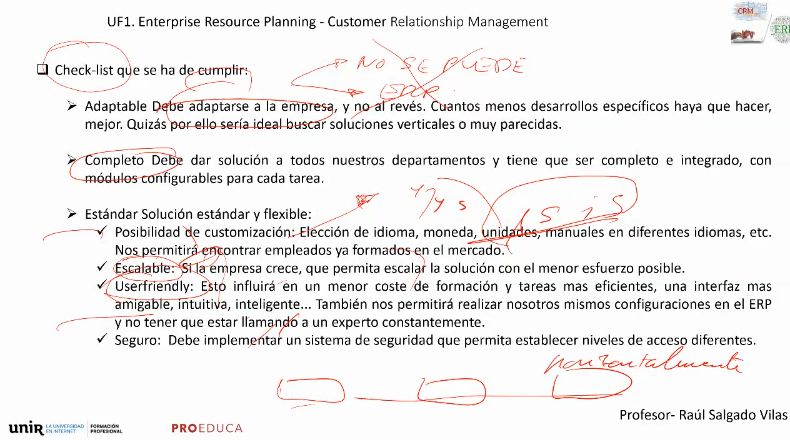

### TIPOS DE CRMS EN EL MERCADO

#### SAP R/3 y B1

Estos son sistemas muy gordos y caros. La mas tocha es la R3. LAs certificaciones en SAP son de unos 20k (curso mas examen). Para que SAP diga que puedes tocar sus productos. SAP es alemana. Son multiplataforma. BBDD tochas. Sistemas tochos.

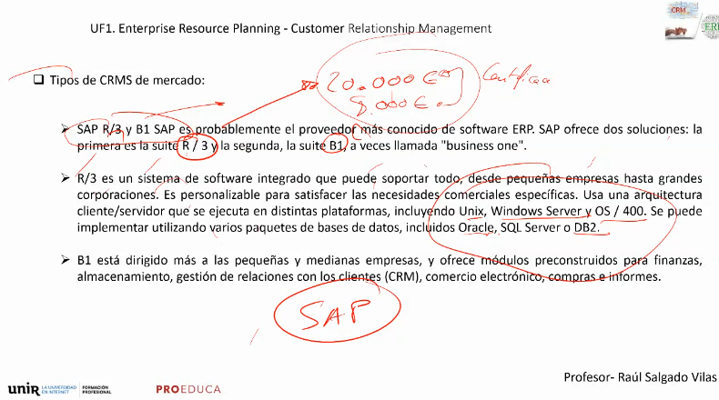

#### MICROSOFT DYNAMICS

Mas pequeño. El NAV se utiliza mas en PYMES. Microsoft intentó hacer el AX para competir con el SAP pero no lo cnsiguió, no le ha quitado mercado.

#### ORACLE

El JdEDWARDS se utiliza en banca y seguros, no llegó a las empresas. Pero están empezando banca y seguros a tirar al SAP tambien.

Oracle intenta competir en empresas con people  soft y ebusines one.

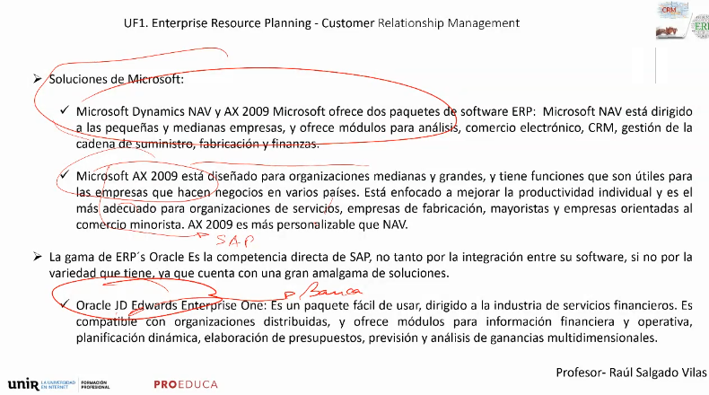

#### LN / BAAN

Temas aeroespaciales y automoviles. Se especializó en catalogos de piezas y cadenas de suministro muy complejas.

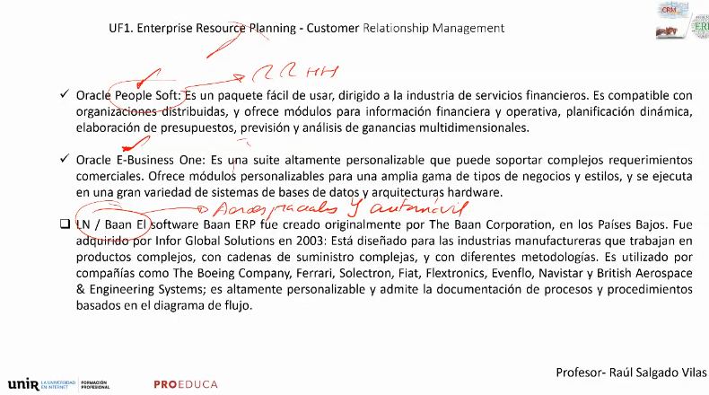

#### SALESFORCE Y ODOO

Nos vamos a centrar nosotros en estudiar estos. Entornos de Pymes sobre todo.

EL 61% de los proyectos se retrasa. El 74% de estos proyectos tienen sobrecoste. 

La triple restriccion de un proyecto es importante. Son el tiempo, el alcance y los costes. Los porcentajes anteriores indican que estos proyectos son complicados.

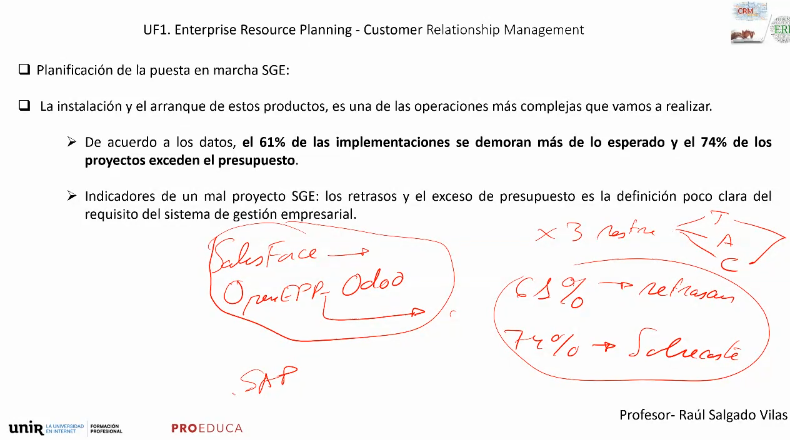

#### STAKEHOLDERS Y KPIS

Cuando estéis sentados con el cliente dos cosas importantes:

STAKEHOLDERS

KPIS

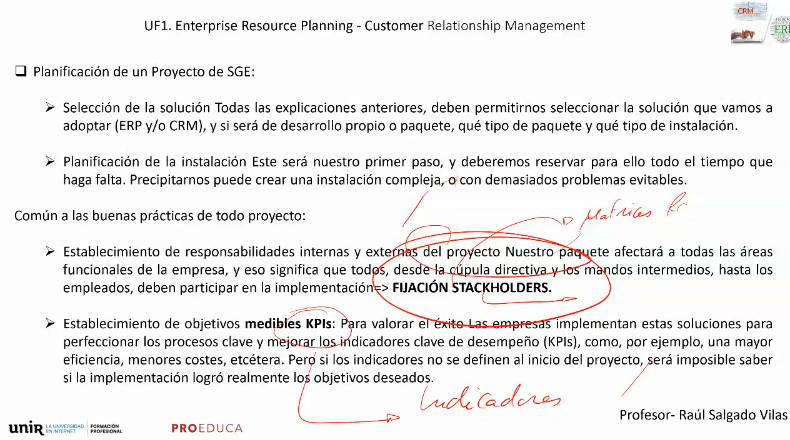

#### DESGLOSE DE TAREAS

Hay que desglosar las tareas atómicas del proyectos. El EWB es el desglose de tareas.

OIDO COCINA!
Revisar condiciones de las BBDD. De donde viene la informacion y de los hilos es lo más importante. Hay unas técnicas para tener claro como hacer toda la integración. Es una de las cosas más importantes. Lo veremos más adelante en el curso

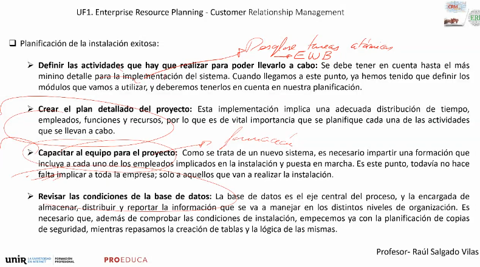

 

